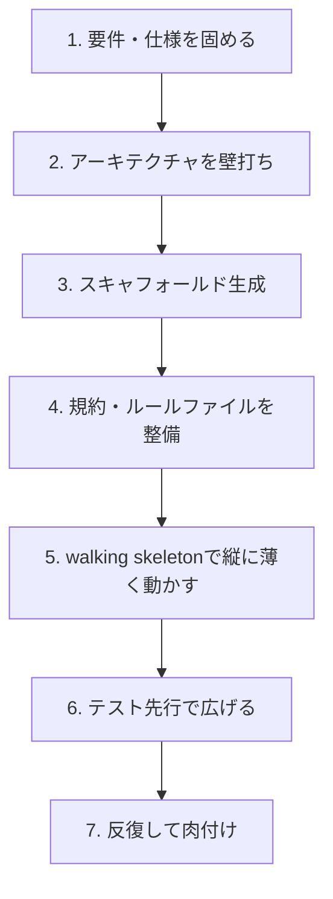

# 新規開発(0→1)のアプローチ

白紙からのプロジェクトは、AIが最も速度を出せる場所です。既存コードの制約がないため、スキャフォールド生成も技術選定の壁打ちもボイラープレートの一括生成も、すべてが軽快に進みます。

しかし、その自由さこそが最大の罠です。制約がないということは、**AIが流行りの一般解へ流れるのを止めるものがない**ということでもあります。白紙だからこそ、制約は人間が能動的に与えなければなりません。これが新規開発における唯一にして最重要の原則です。

::: tip このページの前提
新規開発でAIが「速い」のは事実です。ただし**速く正しい**のと**速く間違う**のは紙一重です。本ページは、AIの速度を活かしつつ暴走を抑える進め方を、順序立てて示します。新規と既存の違いの全体像は[新規開発 vs 既存改修の違い](/approach/greenfield-vs-brownfield)を先に読むと位置づけが明確になります。
:::

## 全体の進め方 — 7ステップ

新規開発でAIを使うときの推奨フローです。上から順に、**制約を固めてから手を広げる**のが骨子です。



| # | ステップ | 目的 | AIの役割 | 関連ページ |
| --- | --- | --- | --- | --- |
| 1 | 要件・仕様を固める | 何を作るかを言語化し制約化する | 要件の構造化・抜けの指摘 | [設計ドキュメントの作り方](/workflow/design-documents) |
| 2 | アーキテクチャを壁打ち | 全体構造を決める | 複数案とトレードオフの提示 | [設計ドキュメントの作り方](/workflow/design-documents) |
| 3 | スキャフォールド生成 | 動く土台を一気に作る | 定型の高速生成 | [はじめの30分](/ready/quickstart-30min) |
| 4 | 規約・ルールファイル整備 | 一貫性の基準を先に置く | 規約初稿の生成 | [はじめの30分](/ready/quickstart-30min) |
| 5 | walking skeleton | 端から端まで薄く貫通させる | 各層の最小実装 | [機能開発の実践](/practice/feature-development) |
| 6 | テスト先行で広げる | 振る舞いを定義しながら肉付け | テスト・実装の生成 | [機能開発の実践](/practice/feature-development) |
| 7 | 反復して肉付け | 縦切りを横へ太らせる | 差分単位の実装 | [機能開発の実践](/practice/feature-development) |

## ステップ1: 要件・仕様を先に固める

新規開発で最もやってはいけないのは、**いきなり「アプリを作って」と頼むこと**です。白紙のAIは即座にそれらしいものを出しますが、それはあなたの意図ではなく、訓練データ上の多数派です。

まず人間の頭の中にしかない意図を、明示的なドキュメントに落とします。要件定義・成功の定義・スコープ外を固めることが、後続すべての制約になります。詳しい作り方は[設計ドキュメントの作り方](/workflow/design-documents)に譲りますが、新規では特に**スコープ外(あえてやらないこと)**を早めに決めるのが効きます。やらないことを決めなければ、AIは「あったら便利」を無限に提案してきます。

```text
あなたはプロダクトマネージャー兼アーキテクトです。
これから新規プロジェクトを始めます。次のざっくりした構想を、
要件のたたき台に整理してください。

構想:
「[ここに作りたいものの生の説明を貼る]」

出力構成:
- 解こうとしている課題 / 対象ユーザー
- 機能要件(ユーザーストーリー形式)
- 非機能要件(性能・可用性・セキュリティ・運用の観点で検討すべき項目)
- スコープ外(このバージョンではあえてやらないこと)
- 未確定事項 / 確認が必要な点

ルール:
- 不明な点は勝手に確定させず「確認が必要な点」として質問する
- 数値目標が必要な箇所は [要決定] と明示し、推測で埋めない
- まだ機能を盛らない。最小で価値を出す範囲に絞る方向で提案する
```

::: warning 仕様を厳密にできるなら、それは強力な武器になる
要件と受け入れ条件を検証可能な形まで詰められるなら、それを実装と検証の正式な起点にできます。これが[仕様駆動開発](/advanced/spec-driven)です。新規開発は既存制約がない分、仕様駆動を導入しやすい絶好の機会でもあります。
:::

## ステップ2: アーキテクチャを壁打ちする

要件が固まったら、全体構造を決めます。ここでAIは「複数の本質的に異なる案を出させ、トレードオフを比較する壁打ち相手」として使います。**1案だけ出させて鵜呑みにしない**のが鉄則です。

重要なのは、AIにチーム情報と制約を渡すことです。これを渡さないと、AIは「一般的に無難な」アーキテクチャ — つまり後述する技術選定バイアスのかかった案 — を出してきます。

```text
次の要件を満たすアーキテクチャを、本質的に異なる3案で出してください。

[要件定義を貼る]

各案を表で比較:
- 概要(主要コンポーネントとデータの流れ)
- メリット / デメリット
- 適する規模・前提
- 運用負荷と実装コストの目安

最後に:
- あなたの推奨と理由
- 「この推奨が成り立たなくなる前提条件」
- 私のチーム事情を踏まえた注意点:
  [人数・スキルセット・運用体制・好む技術・避けたい技術 を書く]

制約:
- 過剰な抽象化・将来の拡張を見越した汎用化はしない(YAGNI)
- 最小構成から始め、必要になってから足せる設計を優先する
```

::: tip 「最小構成」を毎回明示する
新規ではAIが将来を見越して過剰に作り込みがちです。「最小構成から始める」「YAGNI」を制約として毎回渡すと、過剰設計の芽を初期に摘めます。却下した案と理由はADRに残し、後から判断を見直せるようにします([設計ドキュメントの作り方](/workflow/design-documents))。
:::

## ステップ3: スキャフォールドを生成する

アーキテクチャが決まったら、動く土台を一気に作ります。ここはAIの速度が最も気持ちよく効く場面です。ディレクトリ構成、ビルド設定、Linter/Formatter、CI、最小のエントリポイント — これらを一括生成します。

具体的な立ち上げ手順は[はじめの30分](/ready/quickstart-30min)で扱います。ポイントは、スキャフォールドの段階で**何を採用したかを記録しておく**こと。生成された依存やツールチェーンを把握しないまま進めると、後で「なぜこれが入っているのか分からない」状態になります。

::: warning 依存の幻覚(hallucination)に注意
AIは存在しないパッケージ名やバージョン、廃止されたAPIを、自信たっぷりに提案することがあります。スキャフォールドで生成された依存は、**実際にインストールが通り、ビルドが成功するか**を必ず確認します。「もっともらしいが存在しない」依存は新規で頻発します。詳しくは[ハルシネーション対策](/quality/hallucination)も参照してください。
:::

## ステップ4: 規約・ルールファイルを早期に整備する

ここが新規開発で**最も差がつくステップ**です。規約を後回しにすると、ファイルごと・機能ごとにスタイルや設計判断がバラバラになり、一貫性が崩壊します。AIはセッションごとに「その場で無難な」選択をするため、基準を与えなければ揺れ続けます。

だからこそ、**コードが増える前に**規約を固定します。命名規則、エラーハンドリングの方針、ディレクトリ構成のルール、ログの形式、テストの書き方 — これらをルールファイル(各ツールのプロジェクト設定ファイル)に書いておくと、以降のAI生成がその基準に揃います。設定方法は[はじめの30分](/ready/quickstart-30min)で扱います。

```text
このプロジェクトの規約(コーディング規約・設計方針)の初稿を作ってください。
以降、AIにコードを生成させるときの基準として使います。

前提:
- 言語/フレームワーク: [採用したもの]
- アーキテクチャ: [採用した構造の概要]

含めてほしい項目:
- 命名規則(ファイル・関数・型・定数)
- ディレクトリ構成と、各ディレクトリの責務
- エラーハンドリングの方針(例外か戻り値か、ログの粒度)
- テストの方針(何を・どのレベルで書くか)
- やらないことリスト(このプロジェクトで避ける書き方・パターン)

簡潔に。守れない冗長なルールは作らない。
```

::: tip 規約は「AIへの恒久的なコンテキスト」になる
ルールファイルは、毎回のプロンプトに規約を貼り直す手間をなくし、生成の一貫性を底上げします。新規の早い段階で良い規約を置くほど、その後に生成される全コードが恩恵を受けます。逆に、規約なしで数十ファイル進めてから揃えようとすると、手戻りが大きくなります。
:::

## ステップ5: walking skeleton で縦に薄く動かす

土台と規約ができたら、いきなり全機能を作り込んではいけません。まず**walking skeleton(動く骨格)**を作ります。これは、システムの端から端まで(例: UIからAPI、ロジック、DBまで)を、最小の1機能だけで**縦に貫通**させる手法です。

横に広く(機能を全部並べて)作るのではなく、縦に薄く1本通す。これにより、各層の接続・デプロイ・疎通が早期に検証され、アーキテクチャの致命的な見落としを安いうちに発見できます。AIには各層の最小実装を頼みつつ、つながることを優先させます。

```text
walking skeleton を作ります。機能を盛らず、システムの端から端まで
最小1本だけ動かすことが目的です。

対象の縦切り:
[例: 「タスクを1件作成して一覧に表示する」だけ]

各層で最小実装してください:
- [UI層 / API層 / ドメインロジック / 永続化層 など、構成に合わせて列挙]

制約:
- バリデーション・エラー処理・認証などは今は最小限(後で足す)
- ただし各層が実際につながり、起動して疎通することを最優先する
- ハードコードで省略した箇所には TODO コメントを残す

最後に、この骨格で「つながらない/未検証」のリスクが残る箇所を指摘してください。
```

::: warning 縦切りを飛ばして横展開しない
新規で焦って機能を横に並べると、層の接続が後回しになり、終盤で「全部書いたのに動かない」が起きます。1本貫通してから太らせる。この順序が、新規開発の手戻りを最も減らします([機能開発の実践](/practice/feature-development))。
:::

## ステップ6: テスト先行で広げる

骨格が貫通したら、ここからは肉付けです。新規開発の利点は、**既存の振る舞いに縛られず、テストで振る舞いを定義しながら進められる**ことです。これを活かし、機能を足すときはテストを先に書く(あるいはAIにテストと実装を同時に出させ、テストを先にレビューする)流れにします。

テストが振る舞いの仕様になるため、AIの実装が意図とずれていれば即座に気づけます。新規ではまだ回帰の心配が小さい分、テストは「正しさの定義」として前向きに機能します。

```text
次の機能を追加します。先に振る舞いを定義したいので、
受け入れ条件とテストケースから出してください。

機能:
[追加する機能の説明]

手順:
1. まず、この機能が満たすべき受け入れ条件を箇条書きで
2. それを検証するテストケース(正常系・境界値・異常系)を提示
3. テストケースに私がOKを出してから、実装に進む

このプロジェクトの規約([ルールファイルを参照]に従う)を守ること。
テストを先に確定させたいので、いきなり実装コードを書かないでください。
```

## ステップ7: 反復して肉付けする

あとは縦切りを横へ太らせていきます。1機能ずつ、テスト先行で、規約に沿って。各反復を**小さく検証可能な差分**に保つことで、AIの暴走を継続的に抑えられます。詳しい反復の回し方は[機能開発の実践](/practice/feature-development)を参照してください。

## 新規開発に特有の落とし穴

新規はAIの速度が出る分、特有の罠も派手です。あらかじめ知っておけば回避できます。

| 落とし穴 | 何が起きるか | 対策 |
| --- | --- | --- |
| 技術選定バイアス | 流行りのフレームワーク・構成を過剰採用。チームに合わない | チーム事情と制約を渡し、複数案を比較。採用理由をADRに残す |
| 過剰設計(over-engineering) | 今不要な抽象化・汎用化・マイクロサービス化を盛る | YAGNI・最小構成を毎回明示。「なぜ今必要か」を問う |
| 初期の規約不在で一貫性崩壊 | ファイルごとにスタイル・設計判断がバラバラに | コードが増える前に規約・ルールファイルを固定 |
| 依存の幻覚 | 存在しないパッケージ・廃止APIを自信満々に提案 | インストール・ビルドの成功を必ず確認。一次情報で裏取り |
| 横展開の罠 | 層をつなぐ前に機能を並べ、終盤で「動かない」 | walking skeletonで縦に1本通してから太らせる |
| 「動いた」で満足 | テストなしで動いて見え、品質が見えない | テスト先行で振る舞いを定義しながら進める |

::: warning 技術選定バイアスは「無難さ」の顔をしてやってくる
AIが勧める構成は、たいてい「広く使われていて無難」です。しかし無難であることと、あなたのチーム・ドメイン・運用体制に最適であることは別問題です。AIの推奨を「一般解の提示」と受け止め、**自チームの制約に照らして人間が選び直す**。この一手間が、新規プロジェクトの寿命を左右します。
:::

## 「白紙だからこそ制約を自分で与える」

新規開発のすべては、この一文に集約されます。

既存改修では制約がコードに埋め込まれていて、AIはそれを読み取れば的確に振る舞えました。新規には、その制約がありません。だからAIは自由に、しかし無方向に書きます。**制約の不在を埋めるのが、新規における人間の最大の仕事**です。

具体的には、次の4つを能動的に与えます。

- **意図の制約** — 何を作り、何を作らないか(要件・スコープ外)。
- **構造の制約** — どんなアーキテクチャに従うか(壁打ちで選び、ADRに記録)。
- **一貫性の制約** — どんな規約に揃えるか(ルールファイルを早期に固定)。
- **正しさの制約** — 何をもって正しいとするか(テスト先行で振る舞いを定義)。

この4つを早い段階で置くほど、AIの速度は「速い暴走」ではなく「速い前進」になります。

## まとめ

- 新規開発はAIが最も速いが、自由ゆえに暴走しやすい。**制約は人間が能動的に与える**のが大原則。
- 順序が肝。要件・仕様 → アーキテクチャ壁打ち → スキャフォールド → 規約整備 → walking skeleton → テスト先行 → 反復。
- 規約・ルールファイルは**コードが増える前に**置く。後回しにすると一貫性が崩壊する。
- 縦に薄く1本通す(walking skeleton)。横展開を先にしない。
- 特有の落とし穴(技術選定バイアス・過剰設計・規約不在・依存の幻覚)を前提に進める。
- AIの推奨は「一般解」。自チームの制約に照らして人間が選び直す。判断と責任は人間。

<div style="margin-top: 32px; padding: 16px 20px; border-radius: 12px; background: var(--vp-c-bg-soft);">

**次に読む**

- [新規開発 vs 既存改修の違い](/approach/greenfield-vs-brownfield) — 新規と既存でアプローチがどう・なぜ違うかの全体像。
- [既存改修(ブラウンフィールド)のアプローチ](/approach/brownfield) — 次に既存システムへの変更を学ぶなら。
- [設計ドキュメントの作り方](/workflow/design-documents) — 要件・アーキテクチャ・ADRを、AIで作る具体的な手順。
- [仕様駆動開発](/advanced/spec-driven) — 固めた仕様を、実装と検証の正式な起点に引き上げる。
- [はじめの30分](/ready/quickstart-30min) — スキャフォールドと規約ファイルを実際に立ち上げる手順。
- [機能開発の実践](/practice/feature-development) — walking skeletonからテスト先行の反復までを手を動かして。

</div>
