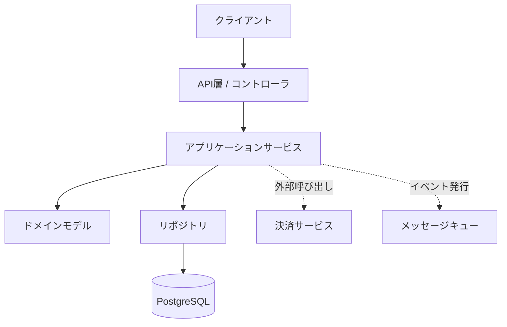
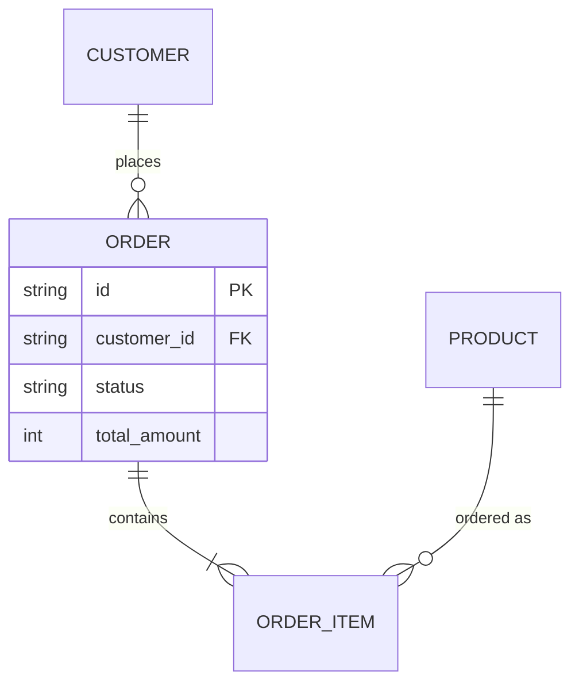
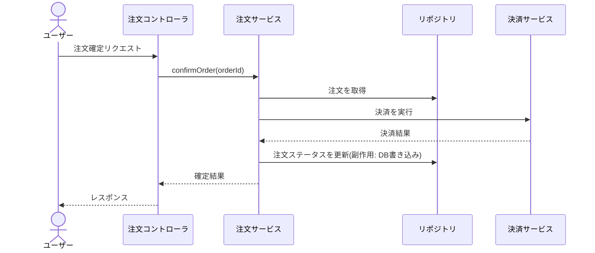

# リバースエンジニアリングと作るべきドキュメント

[既存システム改修のアプローチ](/approach/brownfield)では、「コードが正であり、最大の作業は理解」「リバエンは全部ではなく要否を判断する」という原則を立てました。このページは、その続きとして**核心**に答えます。

> AIを使って、既存システムをどうリバースエンジニアリングするのか。そして、改修のために何を、どこまでドキュメント化すればよいのか。

リバースエンジニアリング(以下リバエン)とは、**動いているコードから、人間が理解・判断できる形の知識を復元する**作業です。AIはこの作業を劇的に速くします。ただし、AIが復元した知識は**コードからの推論であって事実ではない**——この一点を最後まで手放さないことが、このページ全体を貫く原則です。

::: warning 貫く原則: リバエン成果物は必ず実コード・実挙動で裏取りする
AIの理解は流暢ですが、誤り(ハルシネーション)を含みえます。AIが生成した構成図・仕様・ビジネスルールは、すべて「**検証されるまでは仮説**」です。コード・テスト・実行ログで裏を取って初めて、ドキュメントとして信頼できます([ハルシネーション対策](/quality/hallucination)、[出力の評価](/quality/evaluating-output))。本ページの各成果物に「人が検証する点」を必ず添えているのはこのためです。
:::

## AIを使ったリバエンの進め方(段階的)

リバエンは、いきなり細部に潜らず、**粗い理解から段階的に解像度を上げる**のが鉄則です。全体の地図を持たずに一関数を読んでも、それがシステムのどこに位置するか分かりません。次の5段階で進めます。

```text
段階1: 全体俯瞰        ディレクトリ / エントリポイント / 依存
   │                  「このシステムは、ざっくり何で、どう組まれているか」
   ▼
段階2: ドメイン/データ  主要な概念・エンティティ・データモデル
   │                  「何を扱うシステムか。中心となるデータは何か」
   ▼
段階3: 主要フロー追跡   代表ユースケースの処理経路
   │                  「ユーザーが◯◯すると、コードは何をするか」
   ▼
段階4: 外部I/F・副作用  外部連携・DB・I/O・イベント・状態変更
   │                  「外の世界と、どう接しているか」
   ▼
段階5: 暗黙仕様・ルール  分岐の裏にあるビジネスルールを言語化
                      「なぜこの条件があるのか。明文化されていない決まりは」
```

各段階で、解像度を上げながら**前段階の理解を裏切る発見**があれば戻って修正します。リバエンは一直線ではなく、行き来する作業です。

### 段階1: 全体俯瞰

最初に、システムの「形」を掴みます。ディレクトリ構成、エントリポイント、技術スタック、大まかな依存関係。ここでは正確さより**全体像**が目的です。

まず機械的に骨格を集めます。

```bash
# ディレクトリ構成(深さを絞る)
find . -type d -not -path '*/node_modules/*' -not -path '*/.git/*' -maxdepth 3
# エントリポイント候補・依存定義
ls package.json go.mod pom.xml requirements.txt 2>/dev/null
```

集めた情報をAIに渡し、俯瞰させます。

```text
これから既存システムをリバースエンジニアリングします。まず全体像を掴みたい。
以下のディレクトリ構成・依存定義・主要なエントリポイントから、
このシステムの俯瞰図を作ってください。

[ディレクトリツリー、package.json等、エントリポイントのファイルを貼る]

出力:
1. このシステムは何をするものか(1段落の推測。根拠も添える)
2. アーキテクチャの分類(モノリス/レイヤード/ヘキサゴナル/MVC 等、どれに近いか)
3. 主要なモジュール/ディレクトリと、それぞれの推定責務(表で)
4. 採用している主要技術・フレームワーク
5. エントリポイント(起動・リクエスト受付・バッチ等)がどこか

## 重要
- すべて「コードからの推測」です。確信度を 高/中/低 で各項目に付けてください
- 確信度が低い項目は、何を確認すれば確定するかも書いてください
```

::: tip 全体俯瞰は「使い捨て」でよい
段階1の成果物は、後の段階の足場です。後で精度が上がれば上書きされます。ここで完璧を目指す必要はありません。「触る範囲がシステムのどこにあるか」が分かれば十分です。
:::

### 段階2: ドメイン/データモデルの抽出

次に、システムが「何を扱っているか」を掴みます。中心となる概念(ドメイン)、エンティティ、データモデルです。これがシステムの背骨です。

```text
このシステムのドメインモデルとデータモデルを抽出してください。

[データ定義(スキーマ/マイグレーション/モデルクラス/型定義)を貼る]
[ドメインロジックが集まっていそうなディレクトリのコードを貼る]

出力:
1. 主要エンティティ一覧(名前・責務・主要な属性)
2. エンティティ間の関係(1対多・多対多・集約関係)
3. 重要な状態を持つエンティティの状態遷移
4. ユビキタス言語(このコードベース特有の用語と、その意味の用語集)
   - コード上の名前と、ビジネス上の意味が食い違う用語は特に強調

## 重要
- データ定義(スキーマ・型)を一次情報とし、コメントや変数名は補助に
- 名前から意味を推測した箇所は「名前ベースの推測」と明記
```

::: warning 名前は嘘をつくことがある
コード上の `status` フラグが、実は3つ以上の意味を兼ねていたり、`user` テーブルが実際には組織も表していたり——**名前と実態のズレ**は既存システムの常です。AIは名前から素直に意味を推測するので、ここは特に裏取りが必要です。スキーマの制約・実データの分布・使われ方で確認します。
:::

### 段階3: 主要フローの追跡

ドメインが分かったら、代表的なユースケースが「コードの中をどう流れるか」を追います。エントリポイントから始め、層をまたいで処理を追跡させます。

```text
ユースケース「[ユーザーが注文を確定する]」が、コードの中をどう流れるかを
追跡してください。エントリポイントから、データが永続化されるまで。

[エントリポイント(コントローラ/ハンドラ)を貼る]
[呼ばれていそうなサービス・リポジトリ層を貼る]

出力(処理の順序で):
1. 各ステップ: どのファイル・関数で、何が起きるか
2. 各ステップでの分岐(条件と、それぞれの行き先)
3. 副作用が発生する箇所(DB書き込み・外部呼び出し・イベント発火)
4. トランザクション境界(どこからどこまでが原子的か)
5. エラー時の挙動(ロールバック・補償・無視)

## 重要
- 実際に呼ばれているか確信が持てない箇所は「呼び出し未確認」と印を
- このフローを検証するなら、どの入力で実行すればよいかも提案して
```

追跡結果は、後述のシーケンス図の材料になります。AIが「呼び出し未確認」とした箇所は、参照検索や実際のログで裏を取ります。

### 段階4: 外部I/F・副作用の洗い出し

システムが外の世界とどう接しているかを洗い出します。ここはリバエンで**最も見落とされ、最も事故る**領域です。外部API、DB、ファイル、メッセージキュー、キャッシュ、そしてあらゆる副作用。

```text
このシステムが「外部・永続層・副作用」とどう接しているかを網羅的に
洗い出してください。改修時に壊しやすい境界を知るためです。

[I/O・外部連携・設定が関わるコードを貼る]

出力(分類して):
1. 外部サービス呼び出し(宛先・プロトコル・認証・失敗時の扱い)
2. データストア(DB・キャッシュ・検索エンジン等。読み/書きの箇所)
3. ファイル・ストレージI/O
4. 非同期・メッセージング(キュー・イベント・Webhook の発行/購読)
5. その他の副作用(ログ・メトリクス・通知・スケジューラ)

各項目に:
- 同期/非同期、リトライ・冪等性の有無
- これが「外部から前提にされている」可能性(=勝手に変えると壊れる)

## 重要
- 隠れた副作用(モジュール読み込み時の処理・暗黙の初期化)も探して
```

::: tip 「外部が前提にしている副作用」が地雷
ログ出力1つでも、それを監視システムが正規表現でパースしていれば、フォーマットを変えただけで監視が壊れます。イベント発火、特定のレスポンス形式、メトリクス名——**外部が暗黙に依存しているもの**は、コードを読むだけでは見えません。段階4の成果物は、後述の「地雷マップ」に直結します。
:::

### 段階5: 暗黙仕様・ビジネスルールの言語化

最後に、コードの分岐の裏にある**ビジネスルール**を言語化します。「なぜこの条件があるのか」「この値はどこから来たのか」。これが既存システムの最も価値ある暗黙知であり、最も失われやすい知識です。

```text
このコードに埋め込まれている「ビジネスルール」を抽出して言語化してください。
実装の詳細ではなく、「なぜこう振る舞うのか」というルールが知りたい。

[ロジックが集中しているコードを貼る]

出力(ルールごとに):
- ルールの内容(平易な業務の言葉で。「[条件]のとき[結果]」)
- 根拠となるコード箇所
- マジックナンバー・固定値があれば、その値と「なぜその値か」の推測
- このルールが「意図的」か「バグ/なりゆき」か区別がつかない箇所は明記

## 重要
- 推測したルールは、業務担当者に確認すべきものとして印を付けて
- コメントやコミットメッセージに根拠があれば引用して
```

::: warning 「意図的な仕様」と「たまたまの挙動」は区別できない
コードを読んでも、ある挙動が「そう決めた仕様」なのか「誰も気づいていないバグ」なのかは分かりません。AIにも分かりません。リバエンで言語化したルールは、**業務担当者・元の開発者・チケット履歴で意図を確認**するまで「現状こう動いている」という事実にとどめ、「こうあるべき仕様」と混同しないことが重要です。
:::

## 大規模システムでの実務

ここまでの手順は、小さなシステムなら関連コードを丸ごとAIに渡すだけで回ります。しかし、数十万行規模になると**コンテキスト長の壁**にぶつかります。コードベース全体は、どんなに大きなコンテキストウィンドウにも入りません([コンテキストウィンドウ](/concepts/context-window))。

::: tip 最新モデルでも全コードは入らない前提で設計する
Claude 4.X系(Opus 4.8 / Sonnet 4.6 / Haiku 4.5)はいずれも長大なコンテキストを扱えますが、大規模コードベース全体を一度に与えるには依然として足りません。「全部入れる」のではなく「**必要な部分を選んで入れる / 事前に圧縮する**」という設計が必須です。
:::

大規模での基本戦術は次の4つです。

| 戦術 | 内容 | 効く場面 |
| --- | --- | --- |
| 分割 | 範囲をモジュール単位に区切り、1つずつ理解する | 全体が大きすぎて入らない |
| 要約 | ファイル→モジュール→システムの順に要約を積み上げる | 全体像を粗く保ちたい |
| RAG | コードをチャンク化・索引し、質問に関連する部分だけ取り出す | 「どこに何があるか」を横断検索 |
| コード索引 | シンボル・参照のインデックスで依存を機械的に追う | 影響範囲・呼び出し関係の特定 |

### ボトムアップ要約

大規模システムを俯瞰するには、**小さい単位から要約を積み上げる**のが有効です。

```text
ファイル単位の要約 → モジュール単位の要約 → システム全体の要約
（各ファイルを      （ファイル要約だけを    （モジュール要約だけを
  数行に圧縮)         束ねて中粒度に)         束ねて全体像に)
```

各ファイルを数行に要約しておけば、モジュールの要約はファイル要約を束ねるだけで作れ、生コードを再度読む必要がありません。これにより、巨大なコードベースでも**要約の階層**を通じて全体像を保てます。

```text
このファイル群を、それぞれ「3〜5行の要約」に圧縮してください。
後でモジュール全体の要約を、この要約だけから組み立てるためのものです。

各ファイルについて:
- 主な責務(1行)
- 公開している主要な関数/クラスとその役割
- 依存している外部モジュール(import の主要なもの)
- 副作用の有無(DB/外部I/O/状態変更があるか)

[ファイル群を貼る、または1ファイルずつ]
```

### RAGとコード索引

「特定の機能がどこに実装されているか」「ある関数の呼び出し元はどこか」といった横断的な問いには、コードを索引化して必要部分だけ取り出す[RAG](/concepts/rag)が向きます。多くのAIコーディングツールは内部でコードの索引・検索を備えており、これを利用すると、巨大なコードベースでも「質問に関連するファイルだけ」をコンテキストに載せられます。

::: warning RAGで取れるのは「関連しそうな断片」であって全体ではない
RAGは関連部分を取り出しますが、**取りこぼし**が起きえます。重要な依存が検索に引っかからず、コンテキストから漏れることがあります。RAGの結果を「これで全部」と思い込まないこと。影響範囲の確定には、参照検索や`grep`による機械的な裏取りを併用します。
:::

## 作るべきドキュメントのカタログ

ここがこのページの中心です。リバエンの成果として**どんなドキュメントを作るべきか**を、9種に整理します。それぞれについて、**目的 / 含める項目 / AIでの作り方(プロンプト) / 人が検証する点 / 完成の目安**を示します。

::: tip すべてを作る必要はない(後述の線引きを先に読んでもよい)
このカタログは「作れるドキュメントの全部」です。実際には、今回の改修に必要なものだけを選びます。何をどこまで作るかの判断基準は[どこまで作るかの線引き](#どこまで作るかの線引き)で扱います。
:::

### 1. システム概要・コンポーネント構成図

- **目的**: システムが何で、どんな部品が、どう組み合わさっているかを1枚で掴めるようにする。すべての理解の入り口。
- **含める項目**: システムの目的・主要コンポーネントと責務・コンポーネント間の関係・技術スタック・全体構成図。
- **人が検証する点**: コンポーネントの責務が実コードの配置と一致するか。図に描かれた関係が実際の呼び出しと一致するか。
- **完成の目安**: 初見の開発者が、この1枚で「どこに何があるか」の当たりをつけられる。

構成図はMermaidで生成させると、そのままドキュメントに埋め込めます。

```text
段階1〜4で得た理解をもとに、システムのコンポーネント構成図を
Mermaid の flowchart で出力してください。

含めるもの:
- 主要コンポーネント(プレゼンテーション/アプリ/ドメイン/インフラ層など)
- 外部システム(DB・外部API・キュー)は別の形で区別
- コンポーネント間のデータ/制御の流れを矢印で

## 重要
- 実際の依存関係に基づくこと。確信が持てない関係は点線にして注記
- 図は Mermaid のコードフェンス(mermaid 指定)で出力
```

生成されるMermaidの例です。



### 2. 依存関係マップ(内部/外部)

- **目的**: 「何が何に依存しているか」を可視化し、変更の影響範囲とリスクの高い結合点を把握する。
- **含める項目**: 内部依存(モジュール間)・外部依存(ライブラリ・サービス)・依存の方向・循環依存・密結合の箇所。
- **人が検証する点**: 描かれた依存が実際のimport/呼び出しと一致するか(機械的に裏取り可能)。循環依存の有無。
- **完成の目安**: 「この部分を変えたら、どこに波及するか」が図から読める。

```text
モジュール間の依存関係マップを作ってください。改修の影響範囲を
読むためのものです。

[各モジュールのファイル要約、または import 関係を貼る]

出力:
1. Mermaid graph での依存図(矢印は「依存する→される」方向)
2. 循環依存があれば明示
3. 多くから依存される「ハブ」モジュール(変更リスクが高い)を指摘
4. 外部依存(ライブラリ/サービス)の一覧と、それを使っている箇所

## 重要
- 依存は import / 呼び出しの事実に基づくこと
- 機械的に検証できるよう、根拠となるファイル名を併記
```

依存図は、可能なら**機械的に抽出したもの**(`madge`等の依存解析ツールの出力)をAIに整形・解説させると、ハルシネーションのリスクが下がります。

### 3. ドメインモデル・データモデル(ER図/用語集)

- **目的**: システムが扱うデータ構造と、ビジネス概念を確定する。改修がデータ整合に関わる場合の必須資料。
- **含める項目**: エンティティとその属性・関係(ER図)・主要な制約・状態遷移・ユビキタス言語の用語集。
- **人が検証する点**: スキーマ定義との一致。実データでの関係(外部キーがなくても論理的につながっている関係など)。用語の意味が業務と合うか。
- **完成の目安**: このモデルだけ見て、改修がどのデータに触れるかを判断できる。

```text
データベーススキーマとモデル定義から、ER図と用語集を作ってください。

[スキーマ/マイグレーション/モデル定義を貼る]

出力:
1. Mermaid erDiagram でのER図(主要エンティティ・属性・関係)
2. 用語集(エンティティ/重要属性の業務上の意味。名前と実態がずれる
   ものは特に説明)
3. 暗黙の関係(外部キー制約はないが論理的につながっている関係)があれば指摘

## 重要
- スキーマ定義を一次情報に。コード上の名前からの推測は印を付ける
- 図は Mermaid のコードフェンス(mermaid 指定)で
```



### 4. 主要ユースケース/シーケンス図

- **目的**: 代表的な処理が、コンポーネントをまたいでどう進むかを時系列で示す。改修対象のフローを理解・共有するため。
- **含める項目**: アクター・関与するコンポーネント・呼び出しの順序・分岐・副作用の発生点・トランザクション境界。
- **人が検証する点**: 図のシーケンスが実コードの呼び出し順と一致するか。実行ログ/トレースとの突き合わせ。
- **完成の目安**: このシーケンスを見ながら、変更を入れる箇所と影響箇所を特定できる。

```text
段階3で追跡した「[注文確定]」のフローを、Mermaid の
sequenceDiagram にしてください。

含めるもの:
- 関与するコンポーネント(コントローラ/サービス/リポジトリ/外部)
- 呼び出しの順序と、主要な戻り値
- 副作用(DB書き込み・外部呼び出し・イベント発火)が起きる箇所に注記
- 主要な分岐(成功/失敗)

## 重要
- 段階3の追跡結果に忠実に。「呼び出し未確認」だった箇所は注記を残す
- 図は Mermaid のコードフェンス(mermaid 指定)で
```



### 5. API・外部インターフェース仕様

- **目的**: システムが外部に公開している/外部から利用している境界を確定する。改修で互換性を壊さないため。
- **含める項目**: エンドポイント(メソッド・パス・入出力・エラー)・認証/認可・外部API連携の仕様・バージョニング・後方互換の制約。
- **人が検証する点**: 実装(ルーティング・ハンドラ)との一致。実際のリクエスト/レスポンス例での確認。
- **完成の目安**: この仕様を見て、互換性を壊さずに改修できる境界が分かる。

```text
このシステムが公開しているAPIの仕様を、コードから復元してください。

[ルーティング定義・ハンドラ・DTO/スキーマを貼る]

出力(エンドポイントごと):
- メソッド・パス
- リクエスト(パラメータ・ボディの構造)
- レスポンス(成功時の構造・主要なエラーとステータスコード)
- 認証・認可の要否
- 後方互換上「変えると外部が壊れる」要素の指摘

## 重要
- ルーティングとハンドラの実装を一次情報に
- OpenAPI 形式での出力も可能なら併せて
```

::: tip 機械生成できる仕様は機械生成する
OpenAPI定義やGraphQLスキーマが既にコードから生成できるなら、AIに手書きさせるより**生成したものをAIに解説させる**方が正確です。「コードから生成できるものは生成し、AIは説明と差分検出に使う」が原則です。
:::

### 6. ビジネスルール・仕様の棚卸し

- **目的**: コードに埋め込まれた暗黙のビジネスルールを明文化し、失われかけた業務知識を救出する。リバエンで最も価値の高い成果物の一つ。
- **含める項目**: ルールの内容(業務の言葉で)・根拠コード・マジックナンバーの意味・例外的な扱い・「仕様か事故か不明」な項目。
- **人が検証する点**: **業務担当者への確認が必須**。コードがそう動くのは事実でも、それが正しい仕様かはコードからは決められない。
- **完成の目安**: 業務担当者がレビューし、各ルールに「意図的な仕様/直すべきバグ/要検討」の判定がついている。

```text
段階5で抽出したビジネスルールを、棚卸し表にまとめてください。

[抽出済みルール、または対象コードを貼る]

出力(表):
| ルール | 業務上の意味 | 根拠コード | 値の根拠 | 種別の推測 |
- 種別: 意図的な仕様 / バグの疑い / 判断不能 のいずれか(推測)

末尾に「業務担当者に確認すべき項目」リストを別途。

## 重要
- 種別はあくまで推測。最終判定は人(業務担当者)が行う前提
- マジックナンバーは値とコード位置を必ず併記
```

### 7. 既知の負債・リスク・地雷マップ

- **目的**: 「触ると危ない場所」を可視化する。改修時に踏み抜くと事故になる箇所を事前に把握。
- **含める項目**: 技術的負債・密結合/複雑度の高い箇所・テストがない領域・暗黙の前提・過去に障害が起きた箇所・外部が依存している副作用。
- **人が検証する点**: 障害履歴・チケットとの突き合わせ。`// TODO`/`// FIXME`/`// HACK`の実態確認。
- **完成の目安**: 改修計画を立てる人が「どこを慎重に扱うべきか」を判断できる。

```text
このコードの「地雷マップ」を作ってください。改修で踏むと危ない箇所の一覧です。

[対象範囲のコードを貼る]
[あれば、過去の障害チケット・FIXMEコメントを貼る]

出力(箇所ごと):
- 場所(ファイル/関数)
- なぜ危ないか(密結合/副作用/テスト無し/暗黙の前提/過去障害)
- 踏んだときに起きうること
- 改修時の推奨対策(先に特性化テストを張る、等)

## 重要
- 過去の障害・TODO/FIXME/HACK コメントを根拠として拾う
- 危険度を 高/中/低 で
```

### 8. 改修対象まわりのADR

- **目的**: 「なぜ今こういう作りなのか」を復元し、「今回なぜ変えるのか」を記録する。将来の自分とAIへの説明責任。
- **含める項目**: 現状の設計が選ばれた背景(復元)・今回の改修の決定・検討した代替案・トレードオフ・この決定が崩れる条件。
- **人が検証する点**: 復元した「過去の意図」は推測。コミット履歴・元の開発者・チケットで裏を取る。
- **完成の目安**: 数年後にこの改修を見た人が、当時の判断を理解し再評価できる。

リバエンでは2種類のADRが生まれます。**過去の設計意図の復元(推測)**と、**今回の改修判断の記録(事実)**です。両者は明確に区別します。

```text
今回の改修について、ADRを2本作ります。

(A) 現状ADRの復元: なぜ既存コードが今の作りになっているかを、
   コミット履歴・コメント・コードから推測してください。
   これは「推測」であることを文書内で明記すること。

(B) 改修ADR: 今回の変更の決定・検討した代替案・トレードオフ・
   この決定が崩れる条件を記録してください。

[対象コード・関連するコミットメッセージを貼る]

形式は ADR テンプレート(文脈/決定/代替案/結果)に従う。
(A)の推測部分には「[推測:要確認]」を付けてください。
```

ADRの書き方そのものは[設計ドキュメントの作り方](/workflow/design-documents)のADRの節を参照してください。

### 9. 特性化テスト(現挙動の固定)

- **目的**: 現在の挙動を実行可能な形で固定する。リバエンの「最終的な裏取り装置」であり、改修の安全網。
- **含める項目**: 主要関数・フローの入出力を網羅する境界値テスト。期待値は「正しい値」ではなく「**実際に今出る値**」。
- **人が検証する点**: 期待値が「推測」でなく「実行結果」であること。境界の網羅性。
- **完成の目安**: 改修前にこのテストが緑で、改修後も(意図的に変える箇所以外は)緑のまま。

特性化テストは、本カタログの中で**唯一、実行によってAIの理解を検証する成果物**です。他の文書がすべて「人がレビューする仮説」であるのに対し、特性化テストは**機械が現実と照合する**ため、リバエンの信頼性の要になります。

```text
[対象関数/フロー]の現在の挙動を固定する特性化テストを生成してください。

## 方針
- 「正しさ」は判断しない。現状の実際の出力をそのまま期待値にする
- 入力は境界を網羅(ゼロ/負/上限/空/null/月末/端数/異常値)
- 副作用があれば、それも観測して固定する

## 最重要
- 期待値は、あなたの推測ではなく「実際に実行した結果」を入れる。
  推測で埋めた値には [要実行確認] を付け、私が実行して確定します
- まだ実装は変えない。今の実装に対して緑になるテストだけ

[対象コードを貼る]
```

::: warning 特性化テストの期待値は「実行して」埋める
AIに特性化テストを書かせると、期待値も**それらしく推測で埋めて**しまいます。推測値が現実とズレていれば、安全網が穴だらけになります。期待値は必ず**実際に実行した出力**で確定します。AIが推測した値には印を付けさせ、人が実行で置き換えます。これは[レガシー移行・大規模変更](/practice/legacy-migration)のフェーズ2と同じ原則です。
:::

### カタログ早見表

| # | ドキュメント | 主な裏取り手段 | 残す/使い捨て |
| --- | --- | --- | --- |
| 1 | システム概要・構成図 | 実コードの配置・呼び出し | 残す |
| 2 | 依存関係マップ | import/呼び出し・依存解析ツール | 状況次第 |
| 3 | ドメイン/データモデル | スキーマ・実データ | 残す |
| 4 | ユースケース/シーケンス | 実行ログ・トレース | 状況次第 |
| 5 | API・外部I/F仕様 | ルーティング・実リクエスト | 残す |
| 6 | ビジネスルール棚卸し | **業務担当者の確認** | 残す |
| 7 | 負債・リスク・地雷マップ | 障害履歴・チケット | 残す |
| 8 | 改修対象まわりのADR | コミット履歴・元開発者 | 残す |
| 9 | 特性化テスト | **実行(機械が照合)** | 残す(コードの一部) |

## どこまで作るかの線引き

リバエンの最大の失敗は、**「全システムを文書化しようとして、改修が始まらない(そして文書はすぐ腐る)」**ことです。線引きの原則は一つです。

::: warning 最小十分の原則: 「触る範囲+その境界」だけを文書化する
文書化するのは、**今回触る範囲と、それが直接やり取りする境界**だけです。触らないモジュールの内部を丁寧に文書化しても、改修の役には立たず、更新もされずに腐ります。「全体を理解したい」という誘惑に抗い、**改修に必要な分だけ**を作ります。
:::

範囲の決め方は、ブラウンフィールド改修の影響範囲特定([既存システム改修のアプローチ](/approach/brownfield)のステップ1)と連動します。

```text
触る範囲(コア)
  └─ 詳細に文書化する(構成・フロー・ルール・特性化テスト)

その境界(触る範囲が直接依存する/されるもの)
  └─ インターフェースだけ文書化する(入出力・契約)

それ以外
  └─ 文書化しない(俯瞰図に名前が載る程度で十分)
```

### 使い捨て文書 vs 残す文書

リバエン文書には、寿命の違うものが混ざります。これを区別すると、無駄な維持コストを避けられます。

| 種類 | 例 | 扱い |
| --- | --- | --- |
| 使い捨て(理解の足場) | 段階1の俯瞰メモ、作業中の中間要約 | 改修が済んだら捨ててよい。維持しない |
| 残す(資産になる) | ADR・地雷マップ・特性化テスト・更新したAPI仕様 | コードと一緒に保守する。PRに含める |

::: tip 残す文書は「コードと一緒に更新される」ものだけ
残す価値があるのは、**今後も読まれ、更新される文書**だけです。更新されない文書はいずれコードと乖離し、古い仕様書と同じ「誤誘導する文書」になります([設計ドキュメントの作り方](/workflow/design-documents)のドキュメントとコードの乖離を防ぐの節)。特性化テストのように**コードの一部として自動検証される**ものが、最も腐りにくい「残す文書」です。
:::

## リバエン文書の検証

繰り返します。AIが生成したリバエン文書は、**検証されるまでは仮説**です。検証の手段は、文書の種類によって異なります。

| 検証手段 | 何を確かめるか | 対象文書 |
| --- | --- | --- |
| 機械的な照合 | import/参照/スキーマとの一致 | 依存マップ・データモデル・API仕様 |
| 実行(特性化テスト) | 挙動が記述通りか | フロー・ビジネスルール・全般 |
| 実行ログ・トレース | 実際の呼び出し順・経路 | シーケンス図・フロー |
| 障害履歴・チケット | 過去の事実との一致 | 地雷マップ・ADR(復元) |
| 業務担当者の確認 | 仕様か事故かの判定 | ビジネスルール棚卸し |

### ハルシネーション対策の実践

AIは「存在しない関数の呼び出し」「実際にはない依存関係」「もっともらしいが誤ったルール」を、自信たっぷりに生成することがあります。対策は次の通りです。

- **確信度を出させる**: 各記述に高/中/低を付けさせ、低いものを重点的に検証する。
- **根拠を併記させる**: 「この主張の根拠となるファイル・行」を必ず添えさせ、根拠が辿れないものは疑う。
- **機械で裏を取る**: 依存・参照・呼び出しは`grep`・参照検索・依存解析ツールで照合する。
- **実行で裏を取る**: 挙動の主張は特性化テストで現実と照合する。

詳しくは[ハルシネーション対策](/quality/hallucination)と[出力の評価](/quality/evaluating-output)を参照してください。

::: warning 流暢さは正確さの保証ではない
リバエン文書は、整っていて読みやすいほど信用されがちです。しかしAIの出力は**整っていることと正しいことが無関係**です。きれいな構成図ほど、描かれた矢印が実在するかを疑ってください。
:::

## リバエン完了チェックリスト

改修に着手する前に、最低限これだけは確認します。

- [ ] 全体俯瞰(段階1)で、触る範囲がシステムのどこにあるか分かっている
- [ ] 触る範囲のドメイン/データモデル(段階2)を把握した
- [ ] 改修対象の主要フロー(段階3)を、エントリから永続化まで追えている
- [ ] 触る範囲の外部I/F・副作用(段階4)を洗い出した
- [ ] 暗黙のビジネスルール(段階5)を言語化し、要確認項目を業務側に投げた
- [ ] AIが生成した文書の確信度・根拠を確認し、低確信度のものを裏取りした
- [ ] 依存・参照・スキーマを機械的に照合した
- [ ] 改修対象に特性化テストを張り、期待値を**実行で**確定した
- [ ] 文書化の範囲を「触る範囲+境界」に絞った(全体を作り込んでいない)
- [ ] 残す文書(ADR・地雷マップ・特性化テスト等)と使い捨て文書を区別した

## まとめ

- リバエンは**全体俯瞰→ドメイン→フロー→外部I/F→暗黙仕様**の5段階で、粗から細へ。
- 大規模では全コードは入らない前提。**分割・要約(ボトムアップ)・RAG・コード索引**で扱う。
- 作るべき文書は9種。中でも**ビジネスルール棚卸し・地雷マップ・特性化テスト**が既存知識の救出に効く。
- **特性化テストだけが機械で現実と照合される**裏取り装置。期待値は実行で確定する。
- 文書化は**「触る範囲+境界」に絞る**(最小十分)。使い捨てと残すを区別し、残すのは更新される文書だけ。
- すべてのリバエン文書は**検証されるまで仮説**。確信度・根拠・機械照合・実行・業務確認で裏を取る。

<div style="margin-top: 32px; padding: 16px 20px; border-radius: 12px; background: var(--vp-c-bg-soft);">

**次に読む**

- [既存システム改修のアプローチ](/approach/brownfield) — リバエンを踏まえた改修の進め方(影響範囲特定→特性化テスト→小さく変更→検証)。
- [レガシー移行・大規模変更](/practice/legacy-migration) — リバエンで固めた理解をもとに、大規模な置換・移行を安全に進める。
- [設計ドキュメントの作り方](/workflow/design-documents) — ADRなど、残す文書の書き方と乖離の防ぎ方。
- [コンテキストエンジニアリング](/patterns/context-engineering) — 大規模コードをAIに渡す技術(分割・要約・RAG)。
- [ハルシネーション対策](/quality/hallucination) / [出力の評価](/quality/evaluating-output) — リバエン成果物の裏取り。

</div>
